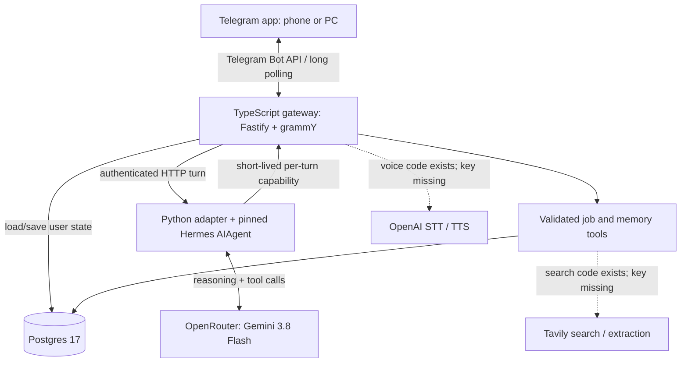

# Hermes Companion — agent handover

Prepared 6 September 2026.

## Continuation update

The initial local commit is `4dba0ed`; voice changes are committed as `4792561`. Private GitHub repository: https://github.com/akhilvuputuri/hermes-companion. GitHub CLI authentication on this Mac is complete; main has been pushed and tracks origin/main. Local source now implements independently selected OpenAI/ElevenLabs/Groq transcription and OpenAI/ElevenLabs synthesis. ElevenLabs output uses MP3 with the correct filename, supported by Telegram sendVoice. ElevenLabs credentials are now saved privately on the Mac and DigitalOcean server. Scribe v2, Flash v2.5, and stock River voice (`SAz9YHcvj6GT2YYXdXww`) are enabled. A live server-side synthesis/transcription round trip passed. The user then tested Telegram voice successfully; database events confirm voice transcription, memory_set and memory_list completed, with one persistent memory. Encrypted nightly Postgres backups are now active, and an isolated restore passed. See `docs/backups.md`; automatic off-server cloud upload remains pending. The sections below preserve the initial deployment snapshot; consult `docs/voice-setup.md` and Git history for subsequent voice work.
This document describes the state at handover, not a claim that the entire product vision is complete. Start here, then read the source. Do not recreate the server or re-pair the user unnecessarily.

## 1. Product intent and decisions

Akhil wants a useful personal assistant and a credible AI engineering portfolio project. Telegram is the first client for conversational text and voice notes. Job search is the initial domain, but interaction should be natural requests, not a rigid listing-processing workflow. The project should eventually support a web/PWA client and realtime voice. Voice engineering is particularly important for applications to companies such as ElevenLabs and Sierra.

The user wants a strong base first, then to ask Hermes through Telegram to develop new skills and features for itself. The desired model roles are Gemini 3.8 Flash for daily conversation, GPT-6 Astra for development orchestration/review, and GLM 5.3 Flash for cheaper development workers. Only the daily model is wired up. Do not tell the user that self-development is available yet.

Authorized decisions already made: DigitalOcean at $24/month, provisioning through the signed-in browser, a dedicated deployment SSH key, Telegram integration, and use of the supplied OpenRouter key. The user completed DigitalOcean billing and approved the SSH key registration. Do not ask for these approvals again for the same scope. New paid services or larger spending commitments need their own decision. The user dislikes avoidable confirmation loops.

## 2. Where the code is

Local source repository:

`/Users/akhilvuputuri/Dev/hermes-companion`

Working directory for this project:

`/Users/akhilvuputuri/Dev/hermes-companion`

The original Codex scratch workspace remains at `/Users/akhilvuputuri/Documents/Codex/2026-09-05/referenced-chatgpt-conversation-this-is-an`; it is not the active source repository.

Source archive:

`/Users/akhilvuputuri/Dev/hermes-companion.zip`.

**Git state:** `main` tracks the private remote https://github.com/akhilvuputuri/hermes-companion. The initial foundation and voice integration are committed and pushed. GitHub CLI is authenticated on this Mac. Deployment currently transfers source over SSH; an automated deployment pipeline remains unfinished. Never publish credentials.

The archive excludes `.env`, pairing state, `.git`, dependencies and generated build folders. It cannot deploy independently without separately supplied credentials. This handover includes infrastructure identifiers and local access paths, so review it before making the repository public.

## 3. Current architecture



The gateway, Hermes and Postgres run as Docker Compose services on one persistent DigitalOcean Droplet. Telegram uses outbound long polling, so there is no public webhook or domain requirement. The app API and Postgres publish on server loopback only; Hermes has no host-published port. There is no public web UI, no API authentication system for browser users, and no realtime audio transport.

This is the real upstream Hermes runtime behind a thin custom adapter. It is not a replacement LLM loop written in TypeScript. However, it deliberately exposes only the companion toolset. It does not currently enable Hermes's broad shell, browser, native skills, or delegation features. Telegram and voice are handled by our gateway rather than the native Hermes Telegram gateway; keep one owner for Telegram polling.

### A normal turn

1. grammY receives a private Telegram message. Numeric user allowlisting happens before processing.
2. The gateway claims the update ID in Postgres and queues work per user.
3. For a voice message, it downloads bounded OGG bytes and transcribes them. Text and transcripts then share the same assistant path.
4. `Assistant.respond` loads conversation history and explicit user memories, creates a run ID and a random expiring capability, and calls Hermes.
5. Hermes calls the external model and may invoke `companion_action`.
6. The adapter calls the gateway's internal tool endpoint with the turn capability. The gateway derives the user from that capability, validates the operation and enforces ownership.
7. The final conversation history and metadata events are stored. Telegram receives plain-text replies, split into 3,500-character pieces; voice replies are optional.
8. The capability is removed even on failure.

## 4. Deployment and operator access

| Item                    | Value                                                          |
| ----------------------- | -------------------------------------------------------------- |
| Droplet                 | `hermes-companion-sgp1`                                        |
| Droplet ID              | `598161491`                                                    |
| Region                  | Singapore / SGP1                                               |
| Public IPv4             | `188.166.246.143`                                              |
| Private IPv4            | `10.104.0.2`                                                   |
| Plan                    | 2 vCPU, 4 GB RAM, 80 GB SSD, $24/month before applicable taxes |
| OS                      | Ubuntu 24.04 LTS                                               |
| Server source directory | `/opt/hermes-companion`                                        |
| Bot                     | `@akhilv_hermes_bot`                                           |
| Current live model      | `google/gemini-3.8-flash` via OpenRouter                       |
| Host setup              | Docker, Compose, UFW, fail2ban, 2 GB swap                      |
| Public inbound service  | SSH; password login disabled                                   |

DigitalOcean dashboard: https://cloud.digitalocean.com/droplets/598161491

The dedicated SSH key is **outside the source repository**, at `/Users/akhilvuputuri/Dev/hermes-companion-ops/hermes_do`; its public key is `hermes_do.pub`. The pinned host key file is `/Users/akhilvuputuri/Dev/hermes-companion-ops/known_hosts`. Keep the private key local and private; never copy it to the agent or include it in archives. Initial host trust used SSH accept-new against the IP observed in the authenticated DigitalOcean dashboard; subsequent commands use strict host verification.

From any directory:

```sh
ssh -i /Users/akhilvuputuri/Dev/hermes-companion-ops/hermes_do \
  -o IdentitiesOnly=yes \
  -o StrictHostKeyChecking=yes \
  -o UserKnownHostsFile=/Users/akhilvuputuri/Dev/hermes-companion-ops/known_hosts \
  root@188.166.246.143
```

Then on the server:

```sh
cd /opt/hermes-companion
docker compose ps -a
curl -fsS http://127.0.0.1:3000/healthz
docker compose logs --tail 50 gateway
```

Do not print `docker compose config` or environment dumps: they expand secrets. `/opt/hermes-build.log` and `/opt/hermes-start.log` hold initial build/start output. `deploy/bootstrap.sh` is the source for host preparation. Do not rerun provisioning on a different machine blindly.

The initial build and migration succeeded. Last observed status: gateway, Hermes and Postgres healthy; migration exited 0. Docker uses persistent volumes `postgres-data` and `hermes-data` under the Compose project. Never run `docker compose down -v` against production.

There are **no automated off-server backups**, no paid Droplet backups, no managed database, no deployment pipeline, and no tested rollback procedure yet. Persistent storage is not backup. Configure encrypted backup and exercise restoration before depending on the system for irreplaceable information.

## 5. Credentials and configuration

The local `.env` contains the supplied Telegram and OpenRouter credentials, generated internal token/database password, and the paired numeric Telegram allowlist. Production has a separate root-readable `/opt/hermes-companion/.env`, mode 0600. Do not paste either file into messages or logs. The user previously supplied secrets in chat; rotate them in a coordinated maintenance step before a public launch, without breaking the running bot unexpectedly.

Configured: Telegram, OpenRouter, Postgres password, internal bearer token, paired user ID.

Missing: OpenAI speech key, ElevenLabs key, Groq key, Tavily key, sandbox-provider credential, GitHub remote/access. DigitalOcean API token is not needed for the current SSH/browser setup; a blank provisioning-only field may be present in the local environment file.

Important drift: `.env.example` and Compose fallback still name `z-ai/glm-5.3-flash`, while the live and local private `.env` set `google/gemini-3.8-flash`. Normalize defaults deliberately before publishing. Do not overwrite production secrets by copying `.env.example`.

Telegram pairing has **completed** through an exact nonce in a private message. Do not reuse the expired links from conversation history. The pairing script does not send a message or run the agent. Do not run `getUpdates` pairing while the deployed gateway is polling. New accounts should use the pairing script during a controlled stop of the gateway, not automatic authorization of the first sender.

## 6. Source map and boundaries

| File                               | Responsibility                                                                             |
| ---------------------------------- | ------------------------------------------------------------------------------------------ |
| `src/main.ts`                      | Assemble DB, tools, assistant, HTTP server and Telegram poller                             |
| `src/config.ts`                    | Zod environment validation                                                                 |
| `src/telegram.ts`                  | Private-chat allowlist, queue, update dedup, commands, audio download and replies          |
| `src/agent.ts`                     | Hermes HTTP client; context loading; capability lifecycle; authoritative approval previews |
| `src/server.ts`                    | Health endpoint and protected internal tool routes                                         |
| `src/protocol.ts`                  | Tool/envelope validation and descriptions                                                  |
| `src/tools.ts`                     | Job/memory operations and approval execution                                               |
| `src/db.ts`                        | Database access, users and metadata events                                                 |
| `src/providers.ts`                 | OpenAI voice adapter, bounded response reads, Tavily adapter                               |
| `src/security.ts`                  | Authorization, allowed chats, URL checks, serial queues                                    |
| `db/001_initial.sql`               | Initial schema                                                                             |
| `services/hermes/bridge.py`        | Real Hermes process boundary and explicit tool registration                                |
| `services/hermes/Dockerfile`       | Pinned upstream installation                                                               |
| `services/hermes/smoke_runtime.py` | Actual Hermes loop tested with local fake provider/callback                                |
| `services/hermes/test_bridge.py`   | Adapter unit tests                                                                         |
| `tests/*.test.ts`                  | DB/tool/approval/gateway/provider/Telegram tests                                           |
| `compose.yaml`                     | Persistent deployment services                                                             |
| `scripts/pair-telegram.mjs`        | Nonce-based allowlist setup                                                                |
| `docs/`                            | Architecture, protocol, security, deployment, demo, verification and roadmap               |

Database tables: `users`, `conversations`, `jobs`, `memories`, `approvals`, `events`, `inbound_updates`. User memory is explicit key/value state in Postgres, not an embedding database. Conversation histories can contain transcripts and user data. Metadata-only traces do not mean the whole database is nonsensitive.

Tool operations: `job_save`, `job_list`, `job_update`, `job_analyze`, `job_delete`, `memory_set`, `memory_list`, `web_search`, `web_read`. Job analysis returns stored role/profile evidence for the agent to reason over; it is not a deterministic fit-scoring model. Search and read require Tavily. There is no interactive authenticated browser.

Deletion uses a stored, owner-scoped exact payload with a 15-minute approval lifetime. `/approve UUID` or `/deny UUID` is interpreted by the gateway outside the model loop. SQL atomically consumes approval and applies the deletion; the model cannot approve. This gate currently covers role deletion, not arbitrary future deployment/application/email actions.

### Hermes integration details worth preserving

Pinned upstream commit: `9c4c548cd555905563b146a6974932b0c5eb8a01`.

Image: Python 3.11 slim; uv 0.12.10; frozen non-dev dependency sync. The service runs as UID 10001. A dedicated `/data/hermes` volume stores Hermes runtime data.

The adapter imports upstream discovery before registering `companion_action`, starts a fresh `AIAgent` for each turn, passes history, and uses `skip_memory=True`, `skip_context_files=True`, `save_trajectories=False`, `max_iterations=12`. A process-wide lock serializes turns because the callback capability is process-global. Do not remove the lock without redesigning callback scoping.

The adapter writes `tools.tool_search.enabled: "off"` into a new dedicated Hermes config. This avoids upstream wrapping the custom tool behind discovery helpers. The exact exposed tool allowlist is asserted and fails closed. Preserve this behavior when upgrading upstream; native defaults can change.

The gateway's shared token authenticates calls to Hermes and the description endpoint. Tool execution needs the separate per-turn capability; the shared token alone must never authorize user tools. Node timeouts revoke capability but do not necessarily terminate a lingering provider request inside Python.

## 7. Voice: current implementation, precisely

`Voice` in `src/providers.ts` currently implements only OpenAI:

- Transcription: multipart POST to `https://api.openai.com/v1/audio/transcriptions`; Bearer `OPENAI_API_KEY`; `model=STT_MODEL`; `file=voice.ogg` with `audio/ogg` MIME. Current default `whisper-1`.
- Synthesis: POST to `https://api.openai.com/v1/audio/speech`; JSON `model`, `voice`, `input`, `response_format: "opus"`. Current defaults `tts-1` and `alloy`; input is truncated to 4,000 characters.
- Both use a 60-second timeout and bounded response reads. Transcript must be nonempty and at most 20,000 characters.

Gateway behavior: private voice notes only; up to 180 seconds and 10 MB; Telegram file paths must match the expected `voice/` pattern; download timeout 30 seconds. Download URLs embed the bot token, so never log them. Audio bytes stay in process memory; the application does not explicitly save recordings. Transcripts enter conversation history. Provider-side retention is separate and must be checked for the selected account settings.

The gateway always sends text first. For voice-note input with `VOICE_REPLIES=true`, it also sends synthesized audio via `replyWithVoice`, labelled “AI-generated voice”. TTS failures preserve the text response. Incoming transcription failure produces a generic message. `/voice` describes configuration, but does not toggle it per user.

**Voice is not live yet:** no speech-provider credential has been configured and no real Telegram audio round trip has passed. Mock provider tests only establish request/response handling. The `/start` copy currently advertises research and voice without checking availability; update it to report enabled capabilities accurately.

## 8. Voice-provider decision and implementation plan

“OpenAPI speech” in earlier discussion meant **OpenAI speech**. OpenAPI is a specification term, not the speech provider. The OpenRouter key used for reasoning does not configure our speech endpoints. An OpenAI key is needed only if OpenAI is selected for speech. STT and TTS can use different vendors.

| Option                    | Practical role in this project                                                                                  | Work still needed                                                                                                   |
| ------------------------- | --------------------------------------------------------------------------------------------------------------- | ------------------------------------------------------------------------------------------------------------------- |
| OpenAI                    | Fastest activation because adapter already exists; useful comparison baseline                                   | Add a dedicated speech key securely, confirm current model/format support, run real audio tests                     |
| ElevenLabs                | Recommended portfolio experiment for user's voice-company interest; separate STT and expressive TTS integration | Implement adapters, obtain key and voice ID, test actual Telegram output format and account access                  |
| Groq transcription        | Useful inexpensive STT baseline paired with OpenAI or ElevenLabs TTS                                            | Implement OpenAI-compatible STT endpoint with separate key; measure accuracy on user's speech                       |
| Self-hosted transcription | Future privacy/cost experiment                                                                                  | Benchmark CPU/RAM/latency separately; do not assume a 4 GB shared production VM can carry this workload comfortably |

Recommendation: implement independent provider selection and compare ElevenLabs against the existing OpenAI path using the same consented voice-note examples. Keep the first release asynchronous. Do not rebuild the agent runtime just to add speech. Voice quality, end-to-end latency and recovery behavior must be measured; a vendor's model-latency claim is not Telegram round-trip latency. Prices change, so verify account-specific pricing before choosing paid plans rather than relying on promotional figures from old messages.

### Verified API starting points (official documentation checked at handover)

OpenAI's audio reference documents separate transcription and synthesis endpoints. Keep using file transcription for completed Telegram notes; realtime is a separate integration. [OpenAI Audio reference](https://developers.openai.com/api/reference/resources/audio)

ElevenLabs file transcription uses `POST https://api.elevenlabs.io/v1/speech-to-text`, `xi-api-key`, multipart `model_id` (for example `scribe_v2`) and `file`. Parse its transcript response into our provider-neutral result. [Create transcript](https://elevenlabs.io/docs/api-reference/speech-to-text/convert)

ElevenLabs synthesis uses `POST https://api.elevenlabs.io/v1/text-to-speech/{voice_id}` with `xi-api-key`, JSON text/model selection, and output-format selection. Confirm a supported OGG/Opus format and account permissions; never rename arbitrary MP3 bytes to `.ogg`. [Create speech](https://elevenlabs.io/docs/api-reference/text-to-speech/convert)

Groq offers an OpenAI-compatible transcription endpoint at `https://api.groq.com/openai/v1/audio/transcriptions`, with its own Bearer key and models such as `whisper-large-v3-turbo`. It accepts OGG. [Groq speech-to-text](https://console.groq.com/docs/speech-to-text)

### Suggested next code changes (not implemented)

1. Extract `SpeechToText.transcribe(audio, metadata, signal)` and `TextToSpeech.synthesize(text, options, signal)` interfaces. Return transcript metadata and audio bytes with explicit MIME/codec, provider and model, rather than assuming every response is Opus.
2. Add validated `STT_PROVIDER` and `TTS_PROVIDER` configuration, vendor-specific keys, and ElevenLabs voice ID. Keep OpenAI defaults compatible. Update `.env.example`, Compose environment pass-through, setup checks and docs together; adding fields to `.env` alone does not pass them into containers.
3. Implement ElevenLabs STT/TTS and Groq STT adapters against current official API contracts. Preserve byte limits, timeouts, sanitized errors and key separation. Use server-fixed provider endpoints; do not accept a model-provided URL for credential-bearing requests.
4. Keep STT transcription as data. Voice input must never bypass the ordinary tool authorization or deletion approval path. Require typed confirmation for consequential actions even when the original request was spoken.
5. Improve missing-provider messages, empty/silent audio handling, language selection, and TTS truncation behavior. Don't unexpectedly speak lengthy job listings or approval identifiers.
6. Add trace spans for download, STT, agent, tools, TTS and delivery under one interaction ID. Current voice event uses a different random ID from the assistant turn, so it cannot yet provide a coherent latency waterfall.
7. Add per-user voice reply preference and explicit audio retention controls if needed; current reply setting is global.
8. Add retries only with bounded budgets and clear idempotency. Avoid automatic provider failover that silently sends sensitive audio to another vendor without the user's chosen policy.

### Voice acceptance criteria

- A real short Telegram voice note transcribes correctly, triggers the requested memory/job tool, and returns text; then optionally a playable native voice bubble.
- Test accent, background noise, company/person names, silence, unsupported files, long notes, provider 401/429/5xx and timeouts.
- Oversized requests are rejected before provider upload where possible; chunked/oversized provider responses remain bounded.
- Text delivery survives TTS failure. Logs never contain provider keys, Telegram download URLs, raw audio or full transcripts.
- A spoken deletion request creates the same authoritative approval as text; speech never approves it.
- Record model/provider, p50/p95 latency, cost estimate, transcription/intent errors and tool task success on a small consented evaluation set. Clearly separate mocked tests from live evaluation results.

## 9. Realtime voice and portfolio path

Telegram voice notes demonstrate asynchronous multimodal input. They do not demonstrate streaming turn-taking, barge-in or conversational realtime audio. Keep that distinction clear in README/demo claims.

For a later PWA, add a separately authenticated client/session boundary and a realtime transport. Use short-lived browser credentials issued by the server; never expose long-lived provider keys. Decide whether to use a modular streaming STT → Hermes → TTS pipeline, a provider-native realtime model with tool bridging, or a managed voice platform. Preserve Postgres identity and the gateway's trusted approval boundary whichever path is selected.

The modular path is easiest to compare across vendors but needs careful latency/cancellation engineering. Reuse the existing tool protocol rather than creating another set of job tools. Define interim/final transcript events, turn-start/end, tool status, audio chunks, interruption and cancellation. The current synchronous `/v1/turn` response is not a streaming protocol.

A credible demo should show interruption stopping audio, cancellation preventing unwanted side effects, recovery from an incorrect company name, and traces explaining latency/cost. A small measured evaluation and honest failure analysis are more useful than a long list of model logos.

## 10. Self-development is the next major missing foundation

Do not enable arbitrary shell execution in the daily agent as a shortcut. The existing production container is not a safe self-editing sandbox and the current server is not a separately isolated development environment.

Target design:

- User asks for a feature through Telegram; create a durable development task with acceptance criteria and spending cap.
- Frontier orchestrator plans and reviews; cheaper GLM workers perform bounded subtasks in a disposable workspace on a repository branch.
- Sandbox receives source, test data and scoped provider access, but no production DB/bot/SSH credentials or host Docker socket.
- Produce an exact commit/diff, test results, evaluation report and usage summary. Independent review checks the result against the request.
- A trusted deployment component binds the user's approval to that reviewed artifact, then deploys with health checks and rollback. Agent-authored approval text is not authorization.

Outstanding choices: sandbox provider/account and budget, private Git remote, scoped repository access, persistent task queue, spending enforcement, review implementation, artifact provenance and deployment controller. The Astra/GLM model-role configuration and delegation tool do not exist yet. User-facing skill improvements can be the first dogfooding task after this boundary is implemented.

## 11. Tests and evidence

Before deployment, 17 TypeScript tests and 4 Python unit tests passed; strict typecheck/build and formatting passed. TypeScript tests use PGlite for real SQL semantics, not an external Postgres daemon. They cover ownership, approvals (including replay/concurrency), capability cleanup, bounded providers, and mocked Telegram handling.

The actual pinned upstream Hermes loop also passed a local smoke using a fake model and callback. During deployment both Docker images built successfully, Postgres migration completed, all services became healthy, and a real Gemini call through the deployed Hermes HTTP adapter returned “Connection test passed.” A separate live OpenRouter Gemini function-call check succeeded.

A real user Telegram conversation that saves/lists memory or jobs has not yet been reported successful at handover. The deployed no-tool smoke does not establish full live tool-loop success. A prior GLM forced tool-call probe with reasoning disabled failed with HTTP 400; a plain completion passed. Investigate compatibility before choosing GLM workers rather than assuming all provider options are interchangeable.

Useful local commands, from the repository:

```sh
npm run check
npm run build
python3 -m unittest discover -s services/hermes -p 'test_*.py'
npm run format:check
```

Handover recheck: typecheck and all 17 TypeScript + 4 Python tests passed. The `tsx` CLI hit a sandbox IPC permission error, so the TypeScript tests were rerun successfully with `node --import tsx --test tests/*.test.ts`. This changes only the launcher.

If installing dependencies on this Mac, the default npm cache previously had permissions issues; use `npm ci --cache /tmp/hermes-companion-npm-cache`. Docker CLI exists locally but the local Docker daemon/app was unavailable. Build/deployment verification therefore used the server. The upstream checkout and its installed test environment are at `/Users/akhilvuputuri/Documents/Codex/2026-09-05/referenced-chatgpt-conversation-this-is-an/work/hermes-upstream` in the original scratch workspace; do not modify them instead of the actual project source.

## 12. Known limitations and next-agent priorities

1. Confirm the paired user's real Telegram memory/job round trip; do not assume health equals functionality.
2. Review and commit the local repository, establish a private remote, and make README capability claims match live configuration.
3. Choose speech provider with the user, obtain credentials through a private local configuration flow, implement independent adapters and complete live voice acceptance tests.
4. Add encrypted off-server backups and test restore. Separate development from production before enabling self-development.
5. Add a durable queue/outbox. Current update claiming is at-most-once attempts: a crash or partial side effect can leave failed/processing updates without replay. Do not blindly retry agent actions.
6. Add actual spend accounting/limits. Iteration caps and timeouts are not financial caps. Reconcile voice/agent traces into one interaction ID.
7. Complete Astra/GLM isolated development mode with exact-artifact approvals and rollback; then let Hermes grow skill packs through Telegram.

Additional caveats: conversation size is bounded but no sophisticated history compaction is implemented; resetting history retains roles/memory. Hermes's dedicated volume may still contain runtime/session artifacts despite suppressed application logs. The schema file is an initial repeatable migration, not a full versioned migration system. No web/PWA, realtime service, email/application submission, interactive browser, or broad skill-authoring interface exists yet.

## 13. Suggested first message to a successor agent

Read this entire HANDOVER.md and inspect the existing source before changing anything. Preserve the live DigitalOcean deployment and completed Telegram pairing. Start by verifying a real Telegram memory/job turn, then prioritize provider-neutral voice-note STT/TTS with ElevenLabs as a portfolio experiment and OpenAI as the existing baseline. Ask only for missing provider credentials/preferences, not for previously approved DigitalOcean/SSH setup. Keep secrets out of output, keep the daily agent's tools constrained, and distinguish implemented behavior from plans. The next major milestone after voice is isolated Astra-orchestrated development with GLM workers, reviewed artifacts, spending limits and user-approved deployment.

### Google integrations in progress — 2026-09-06
See docs/google-integrations.md. Local Gmail read/search code and 5 tests added; all 25 app + 4 adapter tests pass. NOT deployed or authorized. Google project peaceful-region-507806-s2 created for akhilvuputuri@gmail.com; Gmail API enabled. Browser paused at required User Data Policy agreement in OAuth onboarding, before creating client credentials. User additionally requested Google Sheets as job-search UI with Hermes skills; design recorded, implementation pending. Existing cloud Telegram/voice service unchanged. User declined further heavy backup work.

Google OAuth update: client created and saved privately, own test user added, read-only consent screen ready. See docs/google-integrations.md for latest state, superseding earlier pending-client notes. User explicitly forbids agent email sending; Gmail scope must remain gmail.readonly. Local callback script added, pending live grant and deployment.

Gmail LIVE update: Google consent completed by user; exact gmail.readonly scope and mailbox verified. Local/cloud private .env configured; gateway + Hermes rebuilt successfully. Live cloud search (10 results) and one message read passed without printing email content. Google app remains Testing; long-term token lifetime needs follow-up. Sheets remains pending. No email send/change permissions or tools.

### Telegram presentation fix — 2026-09-06
User reported raw Markdown and dense Telegram replies. Added src/telegram-format.ts: safe text/entities rendering for headings, bullets, bold, italic, inline/fenced code, HTTP(S) links, paragraph-aware splitting and UTF-16 offsets. Disabled link previews on generated replies. Voice synthesis receives the rendered plain text. Hermes prompt now favors concise paragraphs, limited questions and avoids tables/nested lists. All 29 Node tests and 4 Python tests passed; build/typecheck passed. Web research, Sheets and preparation skill remain our implementation responsibility and are NOT yet completed; do not imply ongoing background work.


## 2026-09-06 preparation implementation

Added migration 002, owner-scoped retrieved sources, role requirements/assessments, shared preparation tasks, strict prep tools, and the three-tab Sheets adapter. Both local and Compose migration paths apply 001 then 002. Public reading falls back to Jina without a key; search falls back to OpenRouter/Exa using the existing model account. Tavily remains an optional override. Source quotes are checked against saved text; semantic evidence is still agent/user responsibility. Sheets sync is agent-triggered and failure must be reported, not claimed as success.

Google Sheets API enabled in the existing project. Separate Sheets OAuth consent prepared with drive.file and identity scopes; Gmail token untouched. See docs/preparation.md for provisioning and resume instructions. Do not claim live Sheets until token provisioning and first sync are verified. Tests at this point: 35 Node + 4 Python; typecheck/build pass. Live Jina retrieval returned ElevenLabs careers content. Live search and final deployment status will be appended below.

Deployment verified: gateway, Hermes and Postgres healthy; migration 002 present. Live OpenRouter/Exa search returned 3 citations. The 22 saved roles exist, but description values are mostly 6–7-character placeholders or empty; research is needed before substantive gap analysis. Sheets OAuth is pending user consent. Direct main push was rejected by automatic approval review; integration is being saved on feature branch feature/preparation-sheets-research.

Release commit 735e522 is deployed and available in PR https://github.com/akhilvuputuri/hermes-companion/pull/1 (feature/preparation-sheets-research); main not merged. Live research located and saved the original Cohere Singapore Agentic Platform listing from Ashby. Initial preparation contains three unknown assessments (RAG, agent evaluation, enterprise customer delivery) and three suggested preparation tasks. These are questions/practice recommendations, not claims that the user lacks those skills. Sheets first export still awaits consent.

Sheets is now LIVE (2026-09-06). User completed drive.file + identity consent; private token file google-sheets-token.json and workbook metadata google-preparation-sheet.json are in hermes-companion-ops. Local/cloud Sheets environment configured, Gmail fields untouched, gateway recreated healthy. First export succeeded with 22 roles, 3 requirements and 3 tasks. Workbook: https://docs.google.com/spreadsheets/d/1v9eNMsj1xmfMDRsaHnSzD1tjjN-ARdHxrBoxYeUhQeg/edit . Earlier consent failed because only identity scopes were granted. Callback now canonicalizes the email alias and reports safe, specific failure reasons; tests reject missing file scope and additional permissions.
