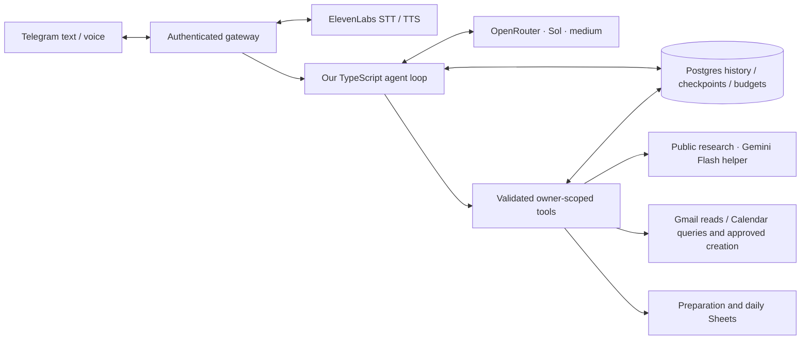

# Companion Agent

**A personal assistant with a TypeScript agent runtime we own.** Talk to it through Telegram text or voice, ask it to research, maintain notes, plan preparation, and manage reminders. Postgres is the durable source of truth; Google Sheets gives you a familiar viewing surface.

Repository: https://github.com/akhilvuputuri/companion-agent.



## What it does

- Read-only interactive Telegram views: `/roles`, `/items`, `/schedules`, `/drafts`, `/briefing` and `/status`; long answers expand within one message. See [views and answer envelopes](docs/telegram-views.md).
- Natural conversation, explicit memories and on-demand versioned text skills.
- General tasks, notes, reminders and source-selectable daily briefings.
- Public web research and evidence-backed role preparation, including questions about unknown experience.
- Telegram voice notes through ElevenLabs Scribe v2, with optional Flash v2.5 spoken replies.
- Photos and PDF documents sent on Telegram: an isolated media specialist reads current-turn images and answers targeted questions over stored documents, returning referenced facts and uncertainty; PDF text is extracted in-process, stored as an owner-scoped source and readable page by page with `source_read`. Image bytes are never retained. Scanned PDFs without selectable text are reported, not guessed. See [media processing](docs/media-specialist.md).
- Read-only Gmail; Calendar queries and [button-approved event creation](docs/calendar-approval.md); separate preparation and daily-assistant Sheet mirrors.
- Durable task steps, source evidence, action receipts, execution budgets and cancellation.
- Approval-gated role deletion and skill activation. No email sending, arbitrary shell execution or self-deployment.

## Runtime

The runtime uses `openai/gpt-5.6-sol` through OpenRouter with explicit medium reasoning. Every request requires supported parameters and price-first provider selection, capped at $2 per million input tokens and $10 per million output tokens by default. A request fails if no eligible provider exists. Missing provider cost data is unknown, never recorded as zero.

Tools have individual names and Zod-validated argument schemas. Identity comes from Telegram authentication and server-owned callbacks, never model arguments. Calls execute sequentially. Model responses and invocation records are saved before advancing. An interrupted write with an uncertain outcome pauses execution for inspection.

Telegram replies are model-written, guided by the mobile delivery context. The renderer handles supported Markdown and Telegram length limits. `/status` is the separate deterministic view of recorded task state; no ledger template replaces conversational answers.

## Start here: a new developer or coding agent

GitHub `main` is the source of truth for integrated code. The last successful `release` workflow and server `RELEASE` identify what is live; main may be ahead after a failed or pending deployment. The production branch is **main**, not master.

1. Read [AGENTS.md](AGENTS.md), [current work](docs/current-work.md), then [HANDOVER.md](HANDOVER.md).
2. Follow [portable development](docs/portable-development.md): clone, use Node 22, install dependencies, and run the mocked checks without production keys.
3. Develop on an independent branch or worktree, open a PR, verify checks and merge. Passing main changes deploy through GitHub Actions; no local production SSH key is needed for ordinary app releases.
4. Watch the release and report its SHA and health. Database/Compose changes, secret rotation and trusted server-command changes still require the documented operator procedure.

[Release/version policy](docs/releases.md) explains tags and notes. [Cloud development](docs/cloud-development.md) explains deployment security and remaining access gaps. Do not rely on another chat's context, unpushed local files or a developer's absolute filesystem path.

## Local setup

Requires Node 22+ and Docker Compose.

```sh
npm ci
npm run setup
# Fill in the private .env file locally; never commit provider credentials.
docker compose up -d postgres
docker compose run --rm migrate
npm run check:env
npm run dev
```

Use the local Postgres URL from `.env.example`. Pair your Telegram user using `npm run pair` and `npm run pair:finish` if setting up a new bot. Existing installations keep their current allowlist. Run only one Telegram poller per bot token.

For the full container stack:

```sh
docker compose up -d --build
```

Only the gateway and Postgres are long-running services; migration is a one-shot job. No Python checkout is downloaded. Postgres and the health endpoint are bound to server loopback. Named volumes persist state; do not delete volumes when updating.

Secrets stay in private environment files, outside Git and container images. See [Google setup](docs/google-integrations.md), [voice setup](docs/voice-setup.md), and [deployment](docs/deployment.md).

## Durable work

Simple conversation needs no plan. Substantial requests can establish tracked steps. Each task initially receives 15 minutes of active execution, 40 model calls and 100 tool calls; the operator can change those defaults. Automatic continuation consumes the same persisted allocation. Model retries and read retries count toward it; writes are never blindly retried.

- `/status`: recorded progress, state and budget usage.
- `/continue`: add another allocation without clearing completed steps.
- `/workcancel`: abort the current model request and prevent subsequent tools; completed actions remain recorded.
- `/approve ID` and `/deny ID`: decide a specific saved approval.

Source quotes, applicability labels and receipts validate recorded support and execution. They cannot prove that a model understood every requirement or judged a source correctly. See [runtime design and recovery](docs/reliable-execution.md).

## Verification

```sh
npm run check
npm run build
npm run format:check
# Optional: paid, bounded Sol smoke test against synthetic in-memory data.
npm run smoke:runtime
```

Tests cover the actual request body, conversation/tool/observation loop, ownership, approval replay and expiry, evidence checks, budgets, cancellation, recovery, context boundaries, schedules, Telegram and provider contracts. They do not claim semantic correctness or production-scale reliability. [Verification record](docs/verification.md) documents live checks.

## Roadmap

Daily usage drives the next changes: better context selection, memory retrieval, semantic deduplication, richer tracing and faster voice responses. Realtime voice, parallel specialist teams, sandbox/shell tools, self-deployment and a web client are separate milestones. The runtime and normalized message boundary allow those clients to be added without moving ownership or permissions into model prompts.

## References and attribution

The initial prototype used [Nous Research Hermes Agent](https://github.com/NousResearch/hermes-agent/tree/9c4c548cd555905563b146a6974932b0c5eb8a01). The obsolete Python adapter has been removed; its implementation remains available in Git history at commit `489f73e`. Historical deployment context is archived under `docs/history`. Upstream projects retain their licenses. This application is independently developed and MIT licensed.

## Evaluations and development

See [evaluation guide](docs/evals/guide.md) and [development process](docs/development-process.md). `npm run eval` is an offline diagnostic; `npm run eval -- --live` runs bounded paid model scenarios in isolated synthetic databases. Production runtime fixes are evaluated separately from the tooling.

## Developing from Codex cloud

Use the connected `akhilvuputuri/companion-agent` environment and read [AGENTS.md](AGENTS.md). The [cloud development guide](docs/cloud-development.md) covers testing, PRs, automatic production releases after passing main checks, bounded diagnostics and operational limits. Live credentials remain on DigitalOcean.

## Engineering journey

The [development journal](docs/journey/README.md) records runtime decisions, production incidents, cost investigation, experiments and remaining evidence gaps. Start with [token cost](docs/journey/03-token-cost.md) for a concrete example. [Claude cloud setup](docs/claude-cloud.md) describes using another coding client with the same repository and release pipeline.

## Research specialist

The main agent can delegate bounded public research to an isolated, read-only specialist. It returns exact-target, source-linked findings; the main agent remains responsible for synthesis and authorized changes. Runs share execution limits and retain linked model/tool traces and separate charges. See [architecture, limits and inspection](docs/research-specialist.md). A [media specialist](docs/media-specialist.md) reuses the same boundary for images and stored documents, optionally on a separate `MEDIA_MODEL`.

## Job alignment

Ask about selected roles or all saved roles. The [job-alignment specialist](docs/job-alignment.md) assesses requirements, established experience, qualified interview evidence and minimum useful preparation. It retains the exact requested scope across internal batches, keeps unknowns explicit, and returns detailed persisted reports for the main agent to synthesize and save using existing tools. General research remains available for other tasks.

## Telegram canvases

The optional Mini App offers persistent, revisioned canvases and a read-only saved-role browser. Open `/canvases` in the bot, or ask it to save a plan or analysis as a canvas. Multiple topics stay separate; earlier revisions remain accessible. Telegram validates the owner before any private content loads. Read the [canvas contract](docs/canvases.md) and [DigitalOcean rollout](docs/miniapp-deployment.md) for configuration, migration 011 and live verification requirements. Calendar approvals remain in Telegram.

## Portable capability plugins

General public research is packaged as a versioned declarative plugin. Enable reviewed agents through the host registry, export/import supported text-only bundles and inspect exact package/skill versions in execution traces. The host retains owner scope, evidence validation, approvals and budgets. See [plugin format and operation](docs/plugins.md). Job alignment and media still use their existing host profiles; external vendor adapters and MCP integration are future work.

### Authoritative state and history

Postgres stores current application records and ordered conversation/execution references. Message content is shared within each owner; active history reads are bounded, with original messages retrieved through conversation search/read tools. Model context is not the complete archive. See [storage, diagnostics and migration](docs/authoritative-storage.md). No automatic trace-retention purge is enabled.
