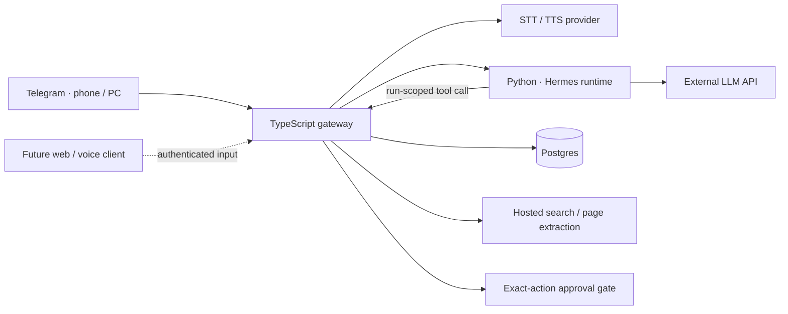

# Hermes Companion

Operator and successor-agent guide: [HANDOVER.md](HANDOVER.md) (deployment state, voice integration plan, and remaining work).

Voice provider configuration: [voice setup](docs/voice-setup.md). OpenAI, ElevenLabs, and Groq transcription are implemented; OpenAI and ElevenLabs speech replies are supported. The deployed assistant uses ElevenLabs Scribe v2 and Flash v2.5; Telegram voice has been tested.

**A persistent personal assistant you can talk to from your phone.** Built around Hermes, with Telegram as the first client and conversational job search as the first domain.

“Find agent engineering roles, compare them with my background, and keep the promising ones.” The assistant decides which tools to use, asks for missing context, and carries the conversation forward. There is no fixed listing-to-report pipeline.

> Status: deployed personal assistant on DigitalOcean with Telegram text/voice, read-only Gmail/Calendar, research, tasks, reminders and Google Sheets mirrors. Local automated tests run without API keys. This is a single-owner project, not a production multi-tenant service. See [reliable execution](docs/reliable-execution.md) for task tracking, repo skills, validation and current limits.

## What is implemented

| Capability        | Implementation                                                                                  |
| ----------------- | ----------------------------------------------------------------------------------------------- |
| Telegram text     | grammY long polling, numeric user allowlist, private chats only                                 |
| Voice notes       | Bounded OGG download → speech-to-text → ordinary agent turn; optional synthesized Opus response |
| Agent reasoning   | Real Hermes `AIAgent` in an isolated Python service, pinned upstream revision                   |
| Job-search tools  | Save, list/filter, update, retrieve evidence for semantic fit analysis, approval-gated delete   |
| Research          | Hosted Tavily search and read-only page extraction; no authenticated browser sessions           |
| Work tracking     | Persistent scope/steps, evidence and action receipts, bounded continuation and cancellation     |
| Repo skills       | Research, synthesis, task execution and personal assistance; approved private overrides         |
| Durable state     | Postgres roles, preferences, conversation history, approvals, inbound IDs and event records     |
| Authorization     | User identity comes from Telegram; short-lived run capability scopes every tool call            |
| Approval gates    | Exact role preview, owner-scoped approval, 15-minute expiry, atomic single use                  |
| Observability     | Metadata-only turn/tool/approval events; transcripts remain in protected conversation storage   |
| Local development | Docker Compose, environment template, SQL schema, TypeScript build, Python bridge tests, CI     |

Application submission, recruiter messaging, arbitrary shell execution, web UI, realtime voice, and interactive browser automation are **not implemented**. User-requested reminders and briefings are supported. They appear in the [roadmap](docs/roadmap.md).

## Architecture



The app owns identity, permissions and durable domain state. Hermes owns the reasoning loop. A small adapter keeps the two languages from leaking into each other. See [architecture and decisions](docs/architecture.md), [protocol](docs/protocol.md), and [security](docs/security.md).

## Run locally

Requirements: Node 22+, Python 3.11–3.13 for bridge tests, Docker Engine with Compose for the full stack. No keys are required for `npm run check`.

```sh
npm ci
npm run check
npm run build
python3 -m unittest discover -s services/hermes -p 'test_*.py'
npm run setup
```

Edit `.env` locally:

1. `npm run setup` generates database and internal service secrets in a private `.env` without overwriting existing settings. To supply your own values, set a random **hex** `POSTGRES_PASSWORD` and a separate `INTERNAL_API_TOKEN` of at least 32 characters. `openssl rand -hex 32` produces a suitable value. Keep the password in `DATABASE_URL` consistent for local Node development. Hex avoids connection-URL escaping issues.
2. Create a bot with Telegram's official [BotFather](https://t.me/BotFather), set its token, and put your numeric Telegram user ID in `TELEGRAM_ALLOWED_USER_IDS`. Multiple IDs use commas without spaces. Usernames are not accepted. Alternatively, run `npm run pair`, open its one-time Telegram link and press Start, then run `npm run pair:finish` to save your user ID. Pairing expires after 15 minutes and only accepts the matching private message.
3. Set `OPENROUTER_API_KEY` and an accessible `HERMES_MODEL`. The provided model is a configurable example; access and cost depend on your account. `LLM_BASE_URL` can point to another trusted OpenAI-compatible endpoint; the current credential variable is retained by the adapter.
4. For voice, set `OPENAI_API_KEY`. For search and page reading, set `TAVILY_API_KEY`. Text chat and role tools work without these optional services. Set `VOICE_REPLIES=true` to answer incoming voice notes with both text and AI-generated audio.

```sh
docker compose up --build -d
docker compose ps
docker compose logs --tail=50 gateway
```

Use `npm run check:env` to list missing settings without printing secret values.

Message the bot in a private chat and send `/start`. The full stack uses long polling, so it needs no public webhook, domain or inbound internet port. Remove any previously configured webhook before using this bot token for long polling. Run only one polling gateway per token.

The first image build downloads the pinned Hermes checkout and its locked dependencies; it can take several minutes. The schema service runs before the gateway starts. Named volumes preserve data across container restarts. **`docker compose down -v` destroys those volumes.**

### Useful conversation examples

- “Remember that I’m a Python developer learning agent evaluation, and I want Singapore-based AI engineering roles.”
- “Search for agent engineering roles that match that direction. Explain why each is worth investigating.”
- “Save the second one. Keep its source URL and the requirements we found.”
- “How do I compare with that role? Separate real gaps from things you don’t know about me.”
- “Mark it as interested and note that I should ask about the evaluation stack.”
- “Show the roles I’m interested in.”
- “Delete that saved role.” → Review the preview, then type the exact `/approve UUID` or `/deny UUID` command.

`/voice` describes speech behavior. `/reset` clears conversation history while retaining roles and explicitly saved preferences. Natural-language approval is deliberately insufficient: the deterministic command bypasses the model and consumes the exact stored action.

### Develop the gateway outside Docker

Start Postgres, migrations and Hermes with Compose, then run the gateway locally. Create an override file outside version control:

```yaml
# compose.local.yaml (add this filename to your personal git exclude)
services:
  hermes:
    environment:
      GATEWAY_URL: http://host.docker.internal:3000
    extra_hosts:
      - "host.docker.internal:host-gateway"
    ports:
      - "127.0.0.1:8000:8000"
```

```sh
docker compose -f compose.yaml -f compose.local.yaml up -d postgres migrate hermes
npm run dev
```

Keep `.env`'s `HERMES_URL=http://localhost:8000` and local `DATABASE_URL`. Do not simultaneously start the Compose gateway with the same bot token. The default Compose stack overrides these addresses internally.

## Repository map

```text
src/                 Telegram, domain tools, protocol, persistence, providers
services/hermes/     Thin Python bridge + allowlist contract tests
db/                  Initial repeatable schema
tests/               SQL, authorization, lifecycle, providers and Telegram tests
docs/                Architecture, protocol, security, deployment, demo and roadmap
.github/workflows/   Key-free CI checks
```

## Verification and honest limits

`npm run check` exercises PostgreSQL behavior through PGlite (a real Postgres engine compiled to WASM), including data-modifying approval CTEs. Provider and Telegram network calls are mocked, so passing tests does not prove provider credentials, model quality, or live audio compatibility. [Verification](docs/verification.md) records what was actually run.

The current worker is single-instance and serial. An inbound update ID is claimed before work; duplicates are ignored, including after partial failures. This avoids blindly replaying mutations but does not guarantee exactly-once replies. If a process dies midway, inspect saved state and ask again. A durable inbox/outbox and resumable work queue are the next reliability milestone.

A successful tool call can persist even when the later model call fails. History is saved only after successful turns. Long conversations may require `/reset`; retain important preferences explicitly. The 180-second gateway timeout revokes tool authority but does not forcibly terminate an ongoing provider request inside Hermes.

## Why this is a useful portfolio project

The interesting engineering is in the boundaries: putting an existing agent runtime behind a narrow, tested capability surface; separating conversational state from authoritative job state; making approvals database operations rather than prompt promises; and supporting voice without coupling the product to one client. The [demo guide](docs/demo.md) shows these properties without claiming unmeasured accuracy or production scale.

## Upstream and provider references

- [Hermes Python embedding guide](https://hermes-agent.nousresearch.com/docs/guides/python-library): the runtime uses `AIAgent`, a toolset allowlist, and explicit conversation history. Native global memory is disabled; application memory is per user in Postgres.
- [Pinned Hermes source](https://github.com/NousResearch/hermes-agent/tree/9c4c548cd555905563b146a6974932b0c5eb8a01): review and retest the adapter before changing the revision.
- [Telegram Bot API](https://core.telegram.org/bots/api): private-message transport and voice files.
- [OpenAI audio API](https://developers.openai.com/api/reference/resources/audio): multipart transcription and synthesized audio.
- [Tavily API](https://docs.tavily.com/documentation/api-reference/introduction): hosted research boundary.

This project is independent of Nous Research, Telegram and the model providers. Review dependencies and their licenses before publishing. The application source is MIT licensed; upstream Hermes and dependencies retain their own licenses.

## Preparation and Google Sheets

Hermes can research public role pages, save evidence-backed requirements, distinguish unknown experience from confirmed gaps, and track shared preparation tasks. A private three-tab Google Sheet serves as a viewing mirror of Postgres. See [setup and boundaries](docs/preparation.md). Gmail remains read-only.

## Versioned skills — September 6 update

The current skill implementation is documented in [Versioned skills](docs/versioned-skills.md). It adds immutable text drafts, evaluation reports, explicit Telegram activation and rollback using existing Postgres storage. The exact companion-tool allowlist remains enforced; native filesystem skill tools and shell execution remain disabled. Frontier review and automatic periodic cleanup are not enabled.

The separate development server proposal was declined. Development-to-PR code was preserved in a local Git stash named `Deferred development-to-PR work; user chose versioned skills`; it is not deployed. The active implementation branch is `feature/versioned-skills`, based on the preparation/Sheets branch.

## Daily assistant expansion

See [Daily assistant](docs/daily-assistant.md) for general tasks and notes, native Hermes schedule parsing with companion delivery, fixed source-selectable briefings, read-only Calendar, and the separate Tasks/Notes/Schedules workbook. Source and delivery limitations are explicit there. This release does not enable arbitrary scheduled agent execution, frontier review, calendar event writes, or automatic skill cleanup.
