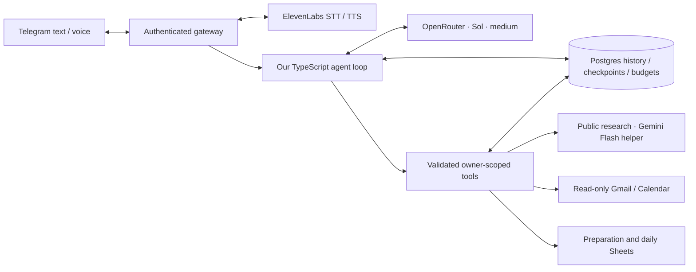

# Companion Agent

**A personal assistant with a TypeScript agent runtime we own.** Talk to it through Telegram text or voice, ask it to research, maintain notes, plan preparation, and manage reminders. Postgres is the durable source of truth; Google Sheets gives you a familiar viewing surface.

Repository: https://github.com/akhilvuputuri/companion-agent.



## What it does

- Natural conversation, explicit memories and on-demand versioned text skills.
- General tasks, notes, reminders and source-selectable daily briefings.
- Public web research and evidence-backed role preparation, including questions about unknown experience.
- Telegram voice notes through ElevenLabs Scribe v2, with optional Flash v2.5 spoken replies.
- Read-only Gmail and Calendar; separate preparation and daily-assistant Sheet mirrors.
- Durable task steps, source evidence, action receipts, execution budgets and cancellation.
- Approval-gated role deletion and skill activation. No email sending, arbitrary shell execution or self-deployment.

## Why build the runtime?

The interesting engineering is the boundary between a model proposing actions and an application executing them reliably. A small loop makes context selection, tool calls, recovery, permissions and stop conditions inspectable. Integrations are reused rather than reimplemented; the reasoning loop is ours.

The runtime uses `openai/gpt-5.6-sol` through OpenRouter with explicit medium reasoning. Every request requires supported parameters and price-first provider selection, capped at $2 per million input tokens and $10 per million output tokens by default. A request fails if no eligible provider exists. Missing provider cost data is unknown, never recorded as zero.

Tools have individual names and Zod-validated argument schemas. Identity comes from Telegram authentication and server-owned callbacks, never model arguments. Calls execute sequentially. Model responses and invocation records are saved before advancing. An interrupted write with an uncertain outcome pauses execution for inspection.

Telegram replies are model-written, guided by the mobile delivery context. The renderer handles supported Markdown and Telegram length limits. `/status` is the separate deterministic view of recorded task state; no ledger template replaces conversational answers.

## Local setup

Requires Node 22+ and Docker Compose.

```sh
npm ci
npm run setup
# Fill in the private .env file locally; never commit provider credentials.
docker compose up -d postgres
docker compose run --rm migrate
npm run check:env
npm run dev
```

Use the local Postgres URL from `.env.example`. Pair your Telegram user using `npm run pair` and `npm run pair:finish` if setting up a new bot. Existing installations keep their current allowlist. Run only one Telegram poller per bot token.

For the full container stack:

```sh
docker compose up -d --build
```

Only the gateway and Postgres are long-running services; migration is a one-shot job. No Python checkout is downloaded. Postgres and the health endpoint are bound to server loopback. Named volumes persist state; do not delete volumes when updating.

Secrets stay in private environment files, outside Git and container images. See [Google setup](docs/google-integrations.md), [voice setup](docs/voice-setup.md), and [deployment](docs/deployment.md).

## Durable work

Simple conversation needs no plan. Substantial requests can establish tracked steps. Each task initially receives 15 minutes of active execution, 40 model calls and 100 tool calls; the operator can change those defaults. Automatic continuation consumes the same persisted allocation. Model retries and read retries count toward it; writes are never blindly retried.

- `/status`: recorded progress, state and budget usage.
- `/continue`: add another allocation without clearing completed steps.
- `/workcancel`: abort the current model request and prevent subsequent tools; completed actions remain recorded.
- `/approve ID` and `/deny ID`: decide a specific saved approval.

Source quotes, applicability labels and receipts validate recorded support and execution. They cannot prove that a model understood every requirement or judged a source correctly. See [runtime design and recovery](docs/reliable-execution.md).

## Verification

```sh
npm run check
npm run build
npm run format:check
# Optional: paid, bounded Sol smoke test against synthetic in-memory data.
npm run smoke:runtime
```

Tests cover the actual request body, conversation/tool/observation loop, ownership, approval replay and expiry, evidence checks, budgets, cancellation, recovery, context boundaries, schedules, Telegram and provider contracts. They do not claim semantic correctness or production-scale reliability. [Verification record](docs/verification.md) documents live checks.

## Roadmap

Daily usage drives the next changes: better context selection, memory retrieval, semantic deduplication, richer tracing and faster voice responses. Realtime voice, delegation, sandbox/shell tools, self-deployment and a web client are separate milestones. The runtime and normalized message boundary allow those clients to be added without moving ownership or permissions into model prompts.

## References and attribution

The initial prototype used [Nous Research Hermes Agent](https://github.com/NousResearch/hermes-agent/tree/9c4c548cd555905563b146a6974932b0c5eb8a01). The obsolete Python adapter has been removed; its implementation remains available in Git history at commit `489f73e`. Historical deployment context is archived under `docs/history`. Upstream projects retain their licenses. This application is independently developed and MIT licensed.
