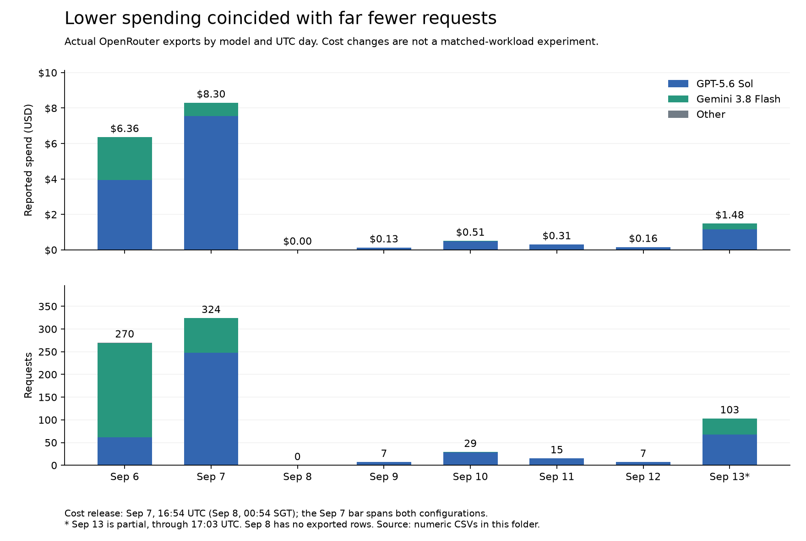

# 03 — Investigating expensive but useful responses

Work: 8 September 2026; measurement follow-up: 14 September. Status: released; lower later usage observed, causal savings not established.

This follows the [exact-target/context investigation](02-context-and-targets.md). Reducing repeated observations helped the runtime retain its selected collection, but useful long answers still carried a large cumulative input bill. The next question was whether that bill came from model choice, repeated context, research repetition or missing accounting.

## What we observed

The owner found response quality useful but API cost unexpectedly high. The recorded 22-role run showed:

| Measurement                              | Recorded value |
| ---------------------------------------- | -------------: |
| Main-model calls                         |             16 |
| Cumulative input tokens                  |        326,051 |
| Output tokens                            |          7,193 |
| Reasoning tokens, within reported output |            394 |
| Reported cache hits                      |              0 |
| Reported main-model cost                 |     $0.8870335 |
| Input component                          |     $0.8151035 |
| Search attempts / distinct query strings |        57 / 37 |
| Tool allocation reached                  |            100 |

Input represented about 92% of the reported main-model cost. These are cumulative tokens across calls, not one 326k-token prompt. The search adapter discarded usage, so this was not the complete task bill. Speech and infrastructure were also outside the total. Evidence: the existing [cost investigation](../cost-controls.md); raw private traces are not copied into this journal.

## Root-cause hypothesis

The sequential loop repeatedly sent growing context and repeated research. A token is paid for again each time it is supplied unless provider caching applies. Context eviction and repeated bookkeeping can also encourage redundant discovery. Zero observed cache hits did not establish a provider bug or guarantee that a stable prefix would fix it.

## Changes and why

1. Reduced total context allowance from 100,000 to 48,000 characters, accounting for instructions, schemas, memories and state before choosing history. Kept complete tool/result groups and retrievable full observations.
2. Separated a stable opening prompt from changing timestamps and task state. Added a per-run OpenRouter session ID to encourage provider stickiness. This creates an opportunity for cache reuse, not a guarantee.
3. Reused normalized identical successful searches for one hour within the same owner and task/run. Different tasks search fresh; expiry does not slide on cache reads. Semantic variants remain distinct.
4. Persisted usage for both the main model and search helper. Reported cost and unknown-cost estimates remain separate; unavailable cost is not zero.
5. Instructed the model to reuse research, inspect promising original pages and synthesize rather than keep searching marginally different queries.

We retained Sol medium reasoning and the output allowance because input dominated the observed cost. The owner declined a proposed $1 task cap; it was removed before deployment. Existing provider unit-price filters remain. Cost visibility does not stop work based on dollars.

## Verification and outcome

[PR #16](https://github.com/akhilvuputuri/companion-agent/pull/16), commit `a31813bd167e3916c1914966a386a4a480f54320`, shipped these mechanisms. The release record reports 78 tests and CI passing, healthy deployment, migration 008 present and no dollar-cap column. Tests cover context grouping, search isolation/expiry, persisted accounting and non-blocking costs above $1.

At release, no controlled post-change production comparison had been run. The evidence established reduced configured context and eliminated repeat network searches on tested cache hits. It did not yet establish a percentage cost reduction, improved cache-hit rate or equal-quality faster completion. The dated follow-up below adds observational evidence without turning it into a controlled experiment.

## 14 September follow-up: raw usage evidence

We retrieved six original OpenRouter daily/model CSV exports and a numeric-only production projection: 164 charge reservations, 229 completed-model events and 60 anonymized runs. The [evidence folder](data/2026-09-14-openrouter/README.md) contains source files, hashes, queries, reproducible Python analysis, a chart, units and accounting limits. No private conversation text, keys or production identifiers are included.

The stored records independently reproduce the original run: 16 Sol completions, 326,051 prompt tokens, 7,193 completion tokens, zero cached tokens and $0.8870335 main-model cost. Its historical search cost remains unavailable. This turns the old incident summary into a numerically inspectable record while preserving its accounting gap.

Across the account's **6–7 September UTC** heavy-use days versus **9–12 September UTC**, average spend fell from **$7.3293/day to $0.2750/day**, while requests fell from **297/day to 14.5/day**. The **96.25% daily spending decline** therefore cannot be credited entirely to runtime efficiency. Much less traffic and a different model/task mix accompanied it.

The same-model comparison is more informative, although still observational:

| Sol measurement                          | Earlier 310 requests | Later 57 requests |
| ---------------------------------------- | -------------------: | ----------------: |
| Average cost/request                     |             $0.03703 |          $0.01911 |
| Average prompt tokens/request            |            13,511.76 |          8,473.28 |
| Cached prompt tokens / all prompt tokens |                0.14% |            21.42% |

Later Sol requests averaged **48.40% lower cost** and **37.29% fewer prompt tokens**, with higher reported cache reuse. This is consistent with the intended direction of the changes. It does not establish equal work/quality or separate the causal contribution of shorter context, prompt caching, price/routing differences and search reuse. Earlier Gemini traffic already cached heavily; the blended account cache fraction fell even while Sol's rose. Model-specific denominators matter.

The owner-supplied screenshot showed **$15.70** for 6–12 September. The later export totals $15.758518 for those UTC labels. Three production calls after the capture time inferred from the filename cost $0.054992; subtracting them gives **$15.703526**, rounding to the screenshot's **$15.70**. This is consistent with a partially elapsed final day, rather than a reason to alter the exported values. See the [cutoff evidence and limitations](data/2026-09-14-openrouter/README.md#reconciling-the-original-screenshot).

Important boundaries: the release occurred late in the 7 September UTC bucket, so the earlier window spans its boundary; 8 September has no exported rows; 13 September is partial and excluded from the comparison. Account exports include calls outside the recovered production ledger. Three ledger reservations have unknown actual cost, and completed-model events overlap main-ledger charges. We do not add these representations together or count unknown cost as zero.

## How this led to later iterations

The first research specialist later exposed a cache-scope gap: parent and child did not share reuse correctly. [Independent foundation review](10-foundation-review.md) fixed that and child elapsed-time accounting. Growing attachments and tool schemas then put new pressure on the smaller context allowance ([attachment follow-up](07-attachments.md)). The later [conversation-continuity incident](17-rolling-conversation.md) showed that cost bounds must protect the immediate exchange, and [checkpoint steering](18-checkpoint-steering.md) changed how new input joins active work. Compact context, provider caching, database normalization and conversation continuity solve related but different problems; none substitutes for the others.

## Next measurement

Compare equivalent target sets, model/provider settings and task outcomes. Capture calls, input/output/cache tokens, actual main/search cost, unknown charges, elapsed time, duplicate searches and useful completion. Include quality review: a cheaper incomplete result is not a win. The dated exports now establish a baseline and collection method, but they are not a task-quality evaluation. Start with ordinary usage; do not automatically restart paid evals.
