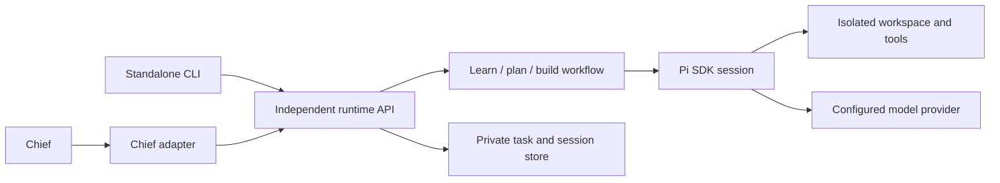

# Independent Pi coding runtime: exploration and first build plan

Research date: 9 October 2026. Status: proposed architecture with a synthetic SDK probe. No runtime implementation, production switch or paid model trial.

## Recommendation and owner direction

Build a standalone TypeScript coding runtime using Pi as a pinned dependency. Give it its own package, task contract, workflow, sessions, CLI, tests and container. Chief becomes one client through a thin adapter. The runtime must work without Chief and be extractable into a new repository.

Owner clarification during this exploration explicitly removes Python compatibility as a requirement and permits changing Chief's adapter. Do not reproduce the existing Python squad, checkpoint schema or model gateway inside the new runtime. The existing runtime can remain operational during development; preserving it does not require preserving its architecture in the replacement.

The first milestone is one agent that can understand a repository, propose a plan and implement approved work with actual checks. Pi owns the model/tool loop and normal context handling. Our code owns a small workflow, workspace execution boundary and task results. Do not start by building another agent framework around Pi.

Hypothesis: depending on Pi for ordinary coding mechanics reduces the custom maintenance burden. Whether it improves planning, completed changes, latency or cost remains unmeasured.

## Evidence and dependency

Chief main was freshly fetched at `0547d4599ee6fd35666fabc9ebdf52b0fa04aec4`. Its [exact release receipt](https://github.com/akhilvuputuri/chief-agent/actions/runs/37893930823), recorded at 2026-10-09 06:33:37 UTC, confirms deployment and startup health at release time. Current health was not inspected. The unrelated dirty local checkout was preserved; research uses an isolated checkout.

Integrated Chief already has a Python squad, targeted navigation, notes, compaction/recovery, checks and review/publication controls. Those mechanisms are a source of lessons, not requirements to port. [Cumulative evidence](journey/coding-agent-lessons.md) distinguishes released mechanisms from demonstrated task quality.

The original `badlogic/pi-mono` project redirects to `earendil-works/pi`. npm marks `@mariozechner/pi-coding-agent@0.73.1` deprecated in favor of `@earendil-works/pi-coding-agent`.

The latest published release inspected is [`@earendil-works/pi-coding-agent@1.1.0`](https://github.com/earendil-works/pi/releases/tag/v1.1.0), published 7 October, tag commit `abe508e1b89912adde45528136c3221eb69acdd7`, MIT licensed. Its npm tarball integrity is `sha512-SeEi/4hdcHNgA9UWlefZl7ZZpm3dzi2OoxNjDHsBJ9o298LNOtbL4DGKgitlEj6uCTccvtw6f2hlCkTPVJ2RXg==`. Pin the release and the complete dependency lockfile when building; avoid examples written for older SDK versions.

Pi requires Node >=22.19.0. This machine's default Node 22.15.0 produced engine warnings; the successful probe used Node 24.19.0. Choose and test a supported exact Node 22 patch for the initial runtime image; generic “Node 22” does not establish compatibility.

## Why Pi fits

| Building block  | Adopt from Pi                                                        | Small amount we own                                  |
| --------------- | -------------------------------------------------------------------- | ---------------------------------------------------- |
| Agent execution | Model/tool loop and session lifecycle                                | Task start, completion, cancellation and deadline    |
| Coding tools    | Line reads, grep/find/list, targeted edits, writes and shell tooling | Workspace confinement and execution policy           |
| Context         | Session tree, compaction and context reconstruction                  | Durable task storage and protected requirements      |
| Interaction     | Streaming events, steering and follow-ups                            | Client-facing event contract and approval response   |
| Configuration   | Providers, extensions, skills and prompts                            | Explicit trusted configuration and allowed resources |
| Results         | Tool outputs and conversation evidence                               | Diff, check receipts and honest completion state     |

Use [`pi-coding-agent`](https://github.com/earendil-works/pi/blob/v1.1.0/packages/coding-agent/docs/sdk.md), not only `pi-ai` or `pi-agent-core`: the lower layers would leave more coding/session work for us to rebuild. Use the SDK in the standalone worker, outside Chief's live process. Its TypeScript API is the most direct integration. RPC is useful for a future non-Node client but unnecessary inside this TypeScript runtime. Print mode alone is too limited for durable interaction. [Interface comparison](https://github.com/earendil-works/pi/blob/v1.1.0/packages/coding-agent/docs/cli-integration.md).

## Clean separation



The runtime must contain no imports from Chief, database tables, Telegram types, GitHub repository IDs, OpenRouter account policy, CodeBuild project names or Chief checkpoint/squad schemas. Use generic interfaces for model configuration, workspace execution and event delivery. Only add an interface when the first implementation actually needs it; a generalized plugin platform is not the goal.

Chief's adapter translates its owner request into a runtime task, relays progress and questions, binds an owner decision to the exact plan revision, and retrieves the result. A CLI client performs the equivalent local interaction. A future web client should not need to pretend to be Chief.

Keep the runtime's package manifest, lockfile, build, tests, README and container together under `coding_runtime_pi/` initially. It must pass installation/build/tests from that directory after being copied outside this repository. Moving it later then requires ordinary repository/package publishing work rather than removing application dependencies. Creating a new remote repository is a separate action; none is created by this research.

## Smallest useful workflow

Interpret learn, plan and build as capabilities of one agent, not a three-agent team. Learn means understanding source and retaining task evidence; it is not model training or automatic global memory changes.

| Intent | Tools                                          | Result                                                                           |
| ------ | ---------------------------------------------- | -------------------------------------------------------------------------------- |
| Learn  | Read, grep, find, list                         | Explanation grounded in files, relevant commands and unresolved questions        |
| Plan   | Same read-only tools                           | Proposed behavior, scope and acceptance checks, with questions where needed      |
| Build  | Guarded read/edit/write plus bounded execution | Changed files/diff, actual check results, remaining issues and final explanation |

A task may stop after learn or plan. Building may revisit code understanding. Avoid a rigid waterfall that requires a second agent or elaborate handoff every time the model inspects another file.

Plan-to-build transition is explicit. A plan is an artifact with a revision/hash; the client approves that exact scope. A changed plan requires a new decision. A local harness can use an explicit CLI operation; Chief can reuse its Telegram confirmation UI through its adapter. The runtime should not know what a Telegram button is.

Pi deliberately does not provide a built-in plan mode, so enforce read-only behavior through actual tool selection, not a prompt that says “do not edit.” [Upstream README](https://github.com/earendil-works/pi/blob/v1.1.0/packages/coding-agent/README.md).

The first build result is an artifact for inspection. Automatic PR creation, independent reviewer orchestration, CI feedback, merge and deployment come later. Existing production publication controls remain in effect until deliberately replaced; this proposal does not turn an unreviewed Pi result into merge authority.

## Proposed package and contract

Keep the initial module structure small:

```text
coding_runtime_pi/
  package.json + package-lock.json
  src/runtime.ts          task lifecycle around Pi
  src/workflow.ts         learn / plan / approved build
  src/resources.ts        explicit instructions and trusted extension
  src/workspace.ts        filesystem and command operations
  src/store.ts            task artifacts and Pi session persistence
  src/cli.ts              standalone client
  tests/                  synthetic provider and real fixture tools
  Dockerfile + README.md
```

An initial API needs only start, inspect, provide input, approve plan, cancel, and explicitly resume an interrupted task. Inputs include a trusted workspace specification, objective, mode, configured model/effort, limits and optional approved plan reference. Results include task ID, outcome, summary, questions/plan when present, artifact identity and check receipts. Events expose stable categories such as text, tool activity, waiting for input, plan ready, checks and completion.

Keep Pi-specific event and session types behind the runtime boundary. Do not design a large HTTP service or multi-tenant scheduler first: a library API and a thin CLI prove independence. Later transport can use the same contract. Task ownership/authentication must be added at the service boundary before remote exposure.

## Decisions that avoid rebuilding today's complexity

### Model access: let Pi use a supported protocol

Prefer Pi's built-in provider implementation. The standalone runtime accepts explicit provider/model configuration; it should not depend on Chief's current custom gateway.

Today's Chief endpoint takes `{callId, role, messages, tools}` and completed OpenRouter messages, with 180,000-byte/120-message bounds. That is not an OpenAI-compatible endpoint. **Change the Chief side**, if it is to remain the credential/policy boundary: expose a narrow job-scoped compatible model proxy or another well-defined adapter that Pi can consume. Keep host policy, call accounting, cancellation and uncertain-response reconciliation there. Standard provider parsing should handle tool/reasoning conversions rather than duplicating them in a second custom model stack.

A trusted custom Pi provider remains a fallback if the policy proxy cannot support a native protocol. Its [provider API](https://github.com/earendil-works/pi/blob/v1.1.0/packages/coding-agent/docs/custom-provider.md) supports custom streaming, but this adds conversion and error-handling obligations. Do not choose it merely to preserve an obsolete Chief wire format.

Standalone development may use its own explicitly configured test credentials. Production provider credentials stay at the chosen trusted boundary, away from model-generated shell commands. The production adapter must preserve existing owner-selected models, price filters and allocations unless separately changed. Research does not run paid inference.

### Sessions: own the task record, use Pi's conversation record

Use Pi session storage for messages, tool history, compaction and branching. Store the small task record, approved scope, findings and workspace artifact separately. Do not port the Python notebook or squad state machine.

For the local first milestone, a private directory outside the editable checkout is sufficient. For disposable remote workers, persist the same session/artifact representation to durable private storage before teardown, using versioned entries/chunks and acknowledged writes. Preserve the active leaf, Pi/schema version and task association. Avoid duplicating full transcripts into every progress event or checkpoint.

Interrupted or uncertain writes require inspection and explicit resume. A session transcript is not evidence that a command can safely run again. Pi's finalized message and settled-run events are appropriate lifecycle signals; an `agent_end` can precede recovery. [Session API](https://github.com/earendil-works/pi/blob/v1.1.0/packages/coding-agent/docs/sdk.md), [persisted format](https://github.com/earendil-works/pi/blob/v1.1.0/packages/coding-agent/docs/session-format.md).

### Context: use one compaction mechanism

Let Pi perform normal [compaction](https://github.com/earendil-works/pi/blob/v1.1.0/packages/coding-agent/docs/compaction.md). Keep the approved requirements and concise factual findings as task artifacts that can be supplied again. Account for summarization calls within the allocation. Test semantic retention rather than assuming a successful summary preserves understanding.

Do not inherit Chief's current 180,000-byte envelope as the runtime's fundamental context limit. The eventual proxy must have documented limits consistent with the model and serialization. Admission should detect oversized requests before sending; model token limits and HTTP byte limits are different.

### Tools and isolation: reuse ergonomics, enforce the boundary

Pi's working directory is not a jail: the probe read a synthetic sibling file through the default reader. Its shell derives an inherited environment and has no default timeout if omitted. [Security contract](https://github.com/earendil-works/pi/blob/v1.1.0/packages/coding-agent/docs/security.md), [tool source](https://github.com/earendil-works/pi/tree/v1.1.0/packages/coding-agent/src/core/tools).

Use Pi's pluggable tool operations for scoped filesystem access and a bounded command executor. Handle realpaths/symlinks, mutation policy, environment stripping, output limits, timeouts and child-process cleanup. Keep the package and private session/provider state outside writable source. A disposable container/OS boundary must prevent repository commands from reading credentials or the agent process; cwd checks alone cannot constrain a shell.

Start with a local isolated runner and test its actual process behavior. Reuse an existing Chief security component only if independently useful; do not import the application to obtain it. CodeBuild is one possible later runner, not a required dependency or a reason to port Python.

### Workflows: one reviewed extension, no ambient discovery

Pass explicit resource, settings, model and session objects to the SDK. Load reviewed repository instructions as text, and only trusted extensions/skills. Disable ambient executable `.pi` resources, automatic package installation and unrelated MCP connections.

A small extension can report findings, ask a question, expose a plan or return a result. Pi's [extension hooks](https://github.com/earendil-works/pi/blob/v1.1.0/packages/coding-agent/docs/extensions.md) also support tool admission and context customization. Do not start with community agent squads, a plugin marketplace, dynamic role creation or a new graph/workflow framework.

## First implementation and acceptance

1. **Independent skeleton:** package/lockfile, supported Node, Pi SDK, explicit resources, local CLI and synthetic provider. Prove it builds and runs after copying it to an empty external directory.
2. **Learn and plan:** read-only source navigation, factual report, questions and an explicit plan artifact. Test attempted writes, outside paths and unauthorized tools.
3. **Build:** approved scope, targeted edits, bounded command execution, real fixture checks, artifact/result and private session persistence. Verify cancel, interruption and explicit resume. No publication credentials required.
4. **Model/quality acceptance:** one separately authorized real task with fixed model/effort and independent grading. Inspect plan completeness, retained facts, patch correctness, checks and actual usage. Synthetic success alone is not this milestone.
5. **Chief integration:** implement the client adapter, compatible model policy boundary and chosen remote runner against the proven runtime contract. Keep the existing runtime operational until this path is accepted. Production switch and publication/reviewer automation are subsequent deliberate steps.

The first useful deliverable is the standalone CLI doing learn → plan → approved build on a small repository and returning a checked patch. It need not include Telegram, Postgres, a three-role team, GitHub publishing, automated merge or production deployment.

Use the same package and fixtures locally and in cloud CI. This session verified GitHub repository read/write and Actions-read access; workflow dispatch and a fresh cloud environment were not tested. Portable task bundles and scoped private trace inspection can close cloud/local debugging gaps without importing broad production credentials.

## Probe results and limits

[Probe source](research/pi-sdk-probe.mjs): published Pi 1.1.0, Node 24.19.0, synthetic files, one synthetic provider response, zero external model calls. Seven assertions passed: line read; cwd escape behavior; targeted edit; stale-target rejection; explicit read-only tool selection; custom provider plus settled event; and linear in-memory restoration without another generation.

The initial direct edit call used an older top-level `oldText/newText` shape and failed. Changing it to the release's declared `edits: [{oldText, newText}]` shape passed. This demonstrates the need to use the pinned SDK's actual declarations; it is not a live model failure.

To rerun, copy the script into a new temporary directory, install `@earendil-works/pi-coding-agent@1.1.0` and `@earendil-works/pi-ai@1.1.0` there using `--save-exact --ignore-scripts`, then execute it with Node >=22.19.0. Synthetic fixtures remain in the OS temporary directory. This research script has no committed dependency lock; the actual runtime must have one.

Not tested: real model tool calls, native Chief proxy compatibility, compaction recall, branching restoration, interruption, Linux process isolation, actual coding quality or cost advantage. The next falsifying test is a small fixed task that the standalone runtime cannot understand or complete. Compare identical tasks/models before attributing an improvement to Pi; keep topology changes distinct from tool/context changes. See [comparison design](coding-model-efficiency.md) and [journal 76](journey/76-pi-harness-exploration.md).
