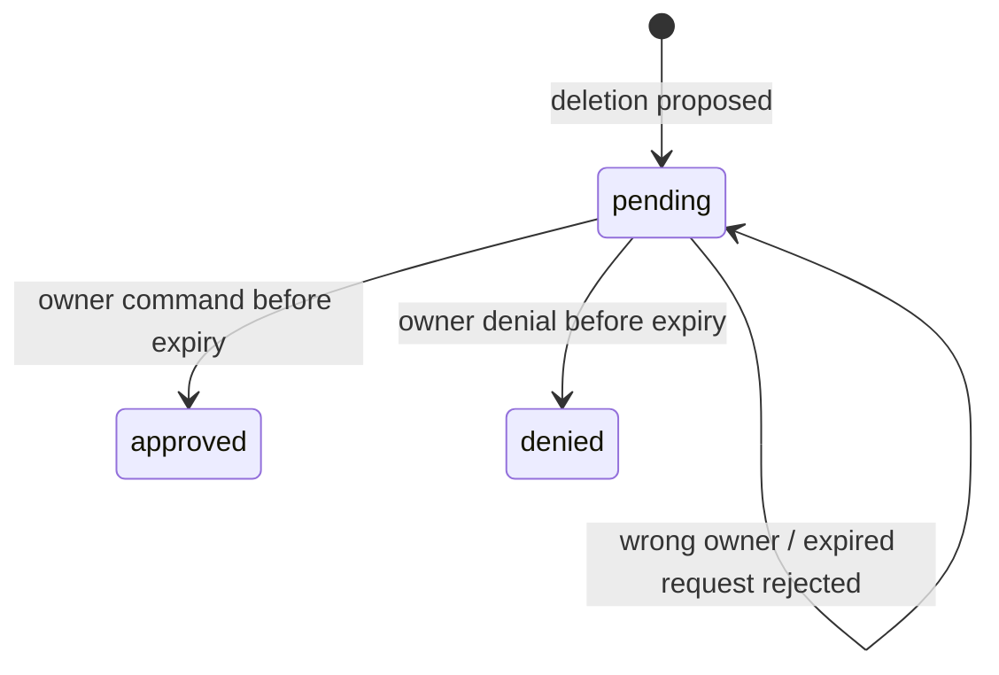

# Protocol v1

These are private service interfaces. Keep them on the Compose network or loopback. There is no public arbitrary execution API.

## Agent request

`POST /v1/turn` on the Python service, with `Authorization: Bearer <INTERNAL_API_TOKEN>`.

```json
{
  "runId": "2b82c528-a825-431c-9fd1-b685b8347a1c",
  "capability": "64-character-opaque-random-value",
  "message": "Compare the saved role with my background",
  "history": [],
  "memories": [{ "key": "background", "value": "Python developer" }]
}
```

History is the complete message list returned by Hermes, including tool messages. Do not truncate arbitrary individual messages or sever tool-call/result pairs. The response is `{ "reply": "...", "history": [...] }`. Maximum message length is 20,000 characters; at most 1,000 history entries. Python caps the request body at 1 MB. Use `/reset` when context exceeds those limits.

Status: 400 invalid envelope; 401 invalid service token; 413 body too large; 429 active runtime busy; 502 runtime failure. Provider bodies and credentials are never returned in errors. Transport v1 is synchronous; retries are not automatic.

## Domain tool request

`POST /internal/tools` on Node, with `Authorization: Bearer <run capability>`. Body is an operation from `src/protocol.ts`. Identity and run association come exclusively from the server's capability map.

| Operation   | Fields                                   | Result / policy                                      |
| ----------- | ---------------------------------------- | ---------------------------------------------------- |
| job_save    | title, company, optional url/description | Saved role                                           |
| job_list    | optional status                          | Most recent 50 roles                                 |
| job_update  | id, optional status/notes                | Updated role                                         |
| job_analyze | id                                       | Role + profile evidence for Hermes analysis          |
| job_delete  | id                                       | Exact preview and approval ID; no immediate deletion |
| memory_set  | key, value                               | Upsert explicit user preference                      |
| memory_list | none                                     | Current user's memories                              |
| web_search  | query                                    | Hosted results, labeled untrusted                    |
| web_read    | url                                      | Hosted page extraction, labeled untrusted            |

Unknown operations, unrelated fields, fabricated statuses, cross-user IDs and expired capabilities are rejected. Results are `{ "result": ... }`. Errors are generic and safe for model context. The service token alone cannot invoke these tools.

`GET /internal/tool-description` requires the service token and is for adapter diagnostics. `GET /healthz` is unauthenticated liveness only; it does not prove model, Telegram or database readiness.

## Events

`events` contains an increasing ID, run UUID, user ID, type, JSON metadata and server timestamp. Current types: `turn.started`, `turn.completed`, `turn.failed`, `tool.started`, `tool.completed`, `tool.failed`, `voice.transcribed`, `approval.decided`.

Tool events include operation name, not arguments or results. Voice events include byte size, not audio or transcript. Approval events include ID and outcome. Voice and direct approval commands currently have their own run IDs. Events trace application activity, not private model reasoning. Future SSE consumers should use event IDs as replay cursors after authorization.

## Approval state machine



Expired records remain `pending` in storage but cannot be consumed. The gateway renders each proposed action from the stored payload after the agent reply. No model tool can approve, deny or rewrite an approval payload. A valid approval removes only the role named in its immutable payload. Status and deletion are atomic; the later trace event and Telegram delivery are not part of that SQL statement.
