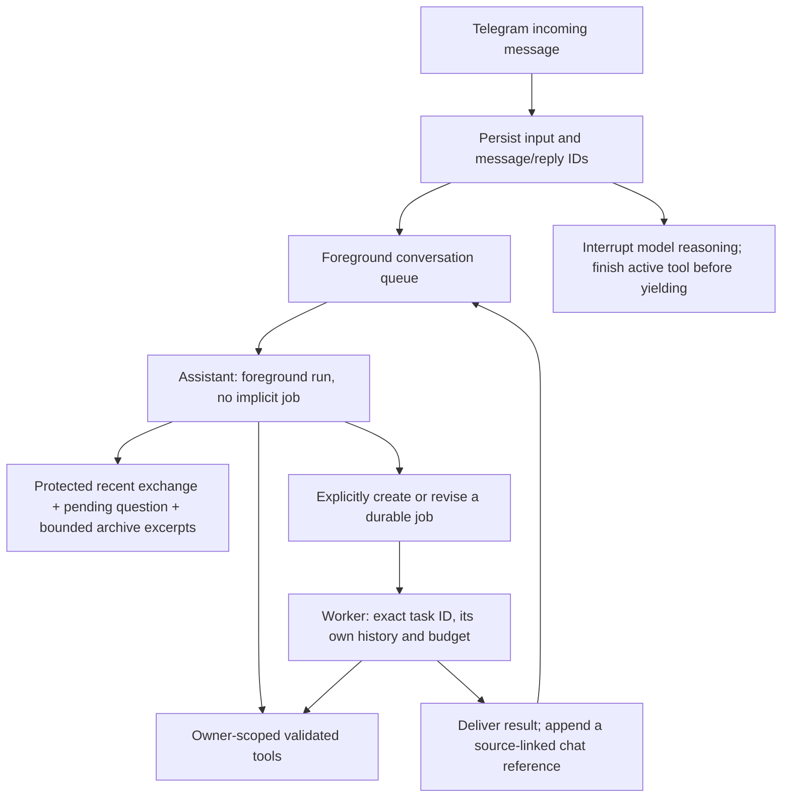

# Rolling conversation and independently addressed work

This change fixes a failure where a short calendar follow-up lost its preceding attachment exchange, retrieved a different event from history, and then inherited an unrelated paused research task. The original attachment extraction and database records were intact. The failure involved context selection, retrieval provenance, owner-global task selection, and message queues together.

## Execution model

Telegram remains one rolling chat. The application does not guess a hidden conversation thread for every topic. Simple questions need no work plan. Foreground runs begin with `work_turns.task_id=NULL`; only `work_start` or an explicit, validated revision binds them. Each background run receives an exact task ID, its checkpoint and its own prior run history. Its first continuation removes unrelated earlier conversation messages from the initial run's input. Alignment scopes and retrieved collections are scoped to the current run or its bound task.

Multiple unfinished jobs may coexist. `/status` lists them; `/status <id>` reads one. `/continue <id>` grants that job another existing time/model/tool allocation. Bare `/continue` is accepted only when exactly one paused/active job is eligible for selection. `/cancel <id>` cancels only that job; `/cancel` or `/workcancel` interrupts the active foreground turn. Completed actions remain recorded. Inspecting a job does not bind or resume it. Revising a job cannot take ownership from an active run or switch a turn that is already bound elsewhere.

## Context and source identity

The latest complete conversational exchange and the current turn's working observations take precedence over optional older history. A large tool catalogue cannot silently erase the previous question. The 48,000-character target now applies to optional history; protected continuity may exceed it. Older recoverable tool results can be projected into exact excerpts plus observation/source IDs. The newest tool round remains complete. A 120,000-character hard textual bound refuses an oversized request rather than sending it without required context. Raw current image bytes remain separately bounded by attachment limits.

Full message payloads, tool calls and results remain immutable in normalized Postgres storage. Context projection never modifies the saved journal. Older provider reasoning is excluded from optional model context; the newest round retains provider continuity. `conversation_contexts` versions contain bounded extractive archive text and a pending-reply record. This is intentionally an excerpt index, **not** an LLM-written or recursive semantic summary. It currently considers forty recent original conversational messages and excerpts older than the latest twelve. It does not promise recall of the entire archive.

When the model ends with `awaiting_user` or `awaiting_approval`, the host saves its question, preceding request and owner-checked source/approval IDs produced or read during that run. The latest foreground pending reply is a reference for a follow-up; it is never an instruction to resume a background job or approve a draft. Later completed foreground replies supersede that active reference, while older versions remain inspectable. Telegram's explicit reply-to message ID can recover the corresponding delivered reply and pending context. The model must still resolve whether a new message answers a question or changes topic.

Images are ephemeral. New input waits for an in-progress image extraction before yielding, because otherwise the next turn could lose the only readable copy. Extracted source records survive and support follow-ups. A pending question does not make an extraction semantically correct; disputed claims must be checked against the exact source.

Conversation search indexes original user/assistant conversation messages and delivered background replies. It excludes tool-result text, copied internal worker prompts and specialist transcripts. Hits have exact message IDs, roles, run/task provenance and bounded chronological neighboring excerpts. Search results cannot recursively become new search evidence. `conversation_read` still provides bounded pages of the original message. Historical assistant claims are not verified facts.

## Input and interruption

`conversation_inputs` records intake immediately, before the Telegram processing queue. It preserves message/reply/update IDs and intake/dispatch/completion times. Text or extracted transcripts become the input record; image/audio bytes are never stored there. New normal input asks the active foreground run to yield. An in-flight model request is aborted; an already-dispatched tool is allowed to finish and journal its actual outcome. Remaining requested tools receive `NOT_DISPATCHED` observations and are not executed. The queued next message then gets the updated conversation. This is interruption followed by a new turn, not speculative concurrent writes within one foreground turn.

Background jobs use separate queues and cancellation controllers, so they do not prevent the foreground conversation from answering. Their delivered final responses enter chat history through a short atomic append with exact retry checks. Internal job prompts stay in job history. Progress is model-written, with delivery context explaining that it should identify the relevant background job naturally.

Startup marks queued/running inputs failed and pauses active durable work using existing restart recovery. It never replays an input or an uncertain write automatically. A user can resend after inspecting saved results. This version does not add a durable automatic inbox replay worker or guarantee immediate interruption of a slow external tool. Time/model/tool allocations and OpenRouter price ceilings remain unchanged; there is no new spending cap.

## Inspection and regression checks

Metadata events link `telegram.input_received`, `telegram.input_ready`, `conversation.routed`, `context.selected`, model/tool events, `conversation.delivery` and Telegram message IDs. Context traces record fixed/exchange/working sizes, projected/omitted counts and total textual input size. Raw messages and sources stay in private Postgres; metadata diagnoses can be retrieved through the normal GitHub diagnostics workflow after installing its reviewed entrypoint update.

For a disputed fact, follow the input ID to its run, inspect the selected context measurements and original message/source IDs, then inspect the actual tool journal. A source reference proves which record was available, not that the model used it correctly. Tests use sanitized synthetic invitations and mocked models; they establish deterministic host behavior, not a benchmark of model judgment.

The focused tests cover large fixed schemas, two similarly described events, original versus recursive tool search, paused-job isolation, concurrent foreground/background execution, interruption during models and writes, owner-scoped controls, durable pending source links, restart handling and exact Calendar button approval. Existing provider, voice, Sheets and domain tests remain required.

## Migration and release

Migration `013_conversation_control.sql` adds input/context tables and relaxes the one-unfinished-job index. It preserves all existing tasks, evidence, budgets, approvals, memories and normalized history. Its legacy index name is retained as a non-unique index so rerunning earlier idempotent migrations does not reintroduce owner-global uniqueness. Migration013 is safe to reapply with the gateway stopped.

This release changes Compose and schema, so ordinary GitHub deployment intentionally refuses it until the reviewed operator rollout establishes the new baseline. After PR review/CI and merge, archive the exact main SHA and use `scripts/deploy-conversation.py` through the existing private operations connection. The script verifies the known v0.3.7 baseline and archive identity, permits only migration013 as new SQL, rejects changed historical migrations, builds before downtime and refuses active runtime work. It stops only the gateway, applies the transactional migration, starts the candidate and checks health. No data reset, job cancellation or new infrastructure is involved.

On startup failure, restore the previous application image and Compose file; retain the additive tables and normalized history. Do not restore the old unique index over newly created jobs or delete records to make a rollback fit. The previous runtime does not understand multiple independently selected tasks, so an operator should inspect any new jobs before prolonged use of that version. If rollback health fails, stop and report the condition. After success, the script records the exact release SHA and installs the reviewed diagnostics entrypoint; later ordinary code releases use the normal GitHub path.
