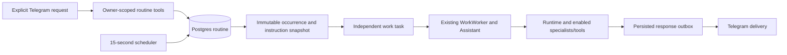

# Scheduled agent routines

Implementation for [issue 56](https://github.com/akhilvuputuri/companion-agent/issues/56). Candidate until the reviewed migration and release are verified.

## User behavior

Ask the chief: “Every day at 11pm, research these topics and send me a sourced summary.” The chief saves a **self-contained instruction**, a name and a schedule using `routine_create`. It should resolve “these” into explicit topics or saved record IDs, explain the next run in Singapore time, and only schedule on an explicit user request.

`routine_list` lists schedules. `routine_update` changes instructions/times or pauses/resumes/cancels future occurrences. `routine_history(id)` shows the ten latest occurrences, exact task IDs, task status, usage counters and saved delivery results/states. Use `/status`, `/continue TASK_ID` and `/cancel TASK_ID` for an existing execution. Pausing or cancelling a routine does **not** cancel a job already launched. A resumed one-time routine needs a new future date if its previous date passed.

Supported schedule syntax reuses `ScheduleParser`: `in 30m`, an ISO datetime, `every 2h`, `daily at 11pm`, weekdays/day names, or five-field cron with one fixed minute. Times without offsets are Singapore time; recurring schedules are at least hourly. No user-supplied executable code, arbitrary cron command or new infrastructure.

Keep `schedule_create` for simple reminders and existing fixed briefings. Those remain unchanged. General routines execute the agent and can therefore incur model/research usage.

## Execution architecture

A locked compare-and-swap database statement commits the occurrence, task, revision and next due time together. `(routine_id, revision, scheduled_at)` is unique. Occurrences retain the original instruction, task ID and launch/skip disposition. Editing a routine cannot rewrite an existing task.

`latest` catches up only the most recent due slot. `skip` skips that slot when it is more than five minutes late. Interval schedules retain their original phase; cron uses Asia/Singapore. Downtime never creates a backlog of one job per missed slot. Any unfinished task from the same routine, **including paused/approval/budget-limited work**, causes the next slot to be recorded as `overlap` and skipped. Resolve or cancel that exact task to unblock future occurrences. Removing an owner from the Telegram allowlist pauses their due routines; re-adding the owner does not automatically resume them. Different routines share the existing single background worker, so start time can be later than due time when another job is running.

Execution uses `Assistant.resumeDetailed` with an exact task ID: no rolling foreground history is injected. Explicit memories, enabled tool/skill catalogue and existing owner-scoped retrieval remain available. The ordinary runtime supplies budgets (15 active minutes, 40 model calls, 100 tool calls by default), cancellation, specialist permissions, evidence checks and approval gates. A schedule is not approval to create a Calendar event or perform a library account write. Background jobs cannot create or change routines; only foreground user turns can do that.

Initially an occurrence is a bounded instruction without mandatory synthetic plan steps. Its ordinary `answer` stop reason closes a step-free task; this means an answer was produced, not independent certification that its content is correct. Pauses/failures stay inspectable and can be continued explicitly. Existing recorded plans retain their completion checks.

## Results, traces and recovery

`routine_occurrences.task_id` links to `work_tasks`, `work_turns`, `runtime_runs`, model/tool events, usage and receipts. `routine_deliveries.run_id` links each saved response to the exact run. Private instructions and report text stay in Postgres; do not export them into public logs.

The worker persists a response before attempting Telegram delivery. Delivery state is `pending → sending → sent`; an exception or restart during sending changes it to `uncertain`. It is not automatically retried: Telegram may already have received some/all messages. The owner can inspect the saved result through routine history and ask for it again without rerunning research. Existing progress updates remain best-effort live messages, not outbox entries.

On restart, existing runtime recovery conservatively pauses unfinished jobs, including queued jobs. No previously launched task or uncertain write is automatically replayed. New due slots will skip until a paused prior task is resolved. A crash between runtime completion and outbox capture can leave an undelivered response in the runtime history; inspect it rather than rerunning tools blindly. This is deliberately conservative, not an exactly-once external delivery claim.

## Contract for future domain agents

Stock/news agents should add their specialist definitions/tools through the existing reviewed plugin mechanism, then let the chief put a self-contained objective and exact parameters into a routine. They do not own a timer and cannot grant themselves permissions or schedules. At execution the chief can delegate to enabled specialists and synthesize their result. Plugin/model versions are resolved at execution; instruction snapshots are immutable, but this is not a frozen software image per occurrence.

Use existing source/evidence records and structured results. Include exact watched instruments/topics and relevant threshold definitions in saved instructions. This foundation does not implement market-price feeds, stock thresholds, ranking/feedback for news, realtime listeners or conditional notification delivery. Those belong to the domain issues. A routine currently reports each executed pass; do not promise “notify only if changed” until an explicit validated silent-result mechanism is added.

## Deployment (operator-reviewed migration 017)

1. Independently review exact PR head and run `npm run check` plus changed-file formatting. Review `scripts/deploy-routines.py` too.
2. Merge only after approval and CI. Ordinary release refuses the DB/Compose change.
3. Verify live RELEASE is the script's pinned baseline `dd2be311e4cbfaecd75eca64bb0bcb730abfab76`. If newer, reconcile and re-review the operator script; do not bypass the guard.
4. Transfer a Git archive of the exact reviewed main SHA and the reviewed operator script using the existing local operations connection. Run `python3 deploy-routines.py ARCHIVE SHA` on the host. It validates historical migrations/Compose, locks releases, builds before stopping, refuses active work/input, applies only 017 and checks health. No secrets are copied into development.
5. Verify release SHA, health, migration marker and preservation of existing records. Retry ordinary main release for standard pipeline verification. No paid/live routine is created by this rollout.

Rollback restores the previous application/Compose/source, retaining the additive tables and records. Never delete routine results or replay uncertain work during recovery. Existing reminders and schedules are not migrated or reset.
